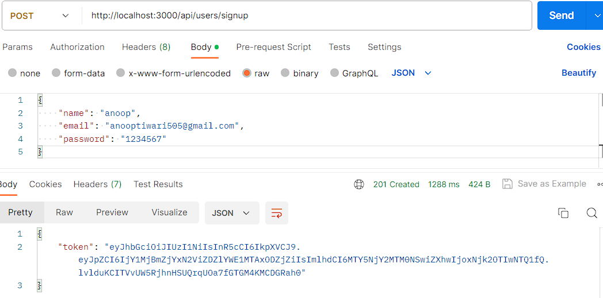
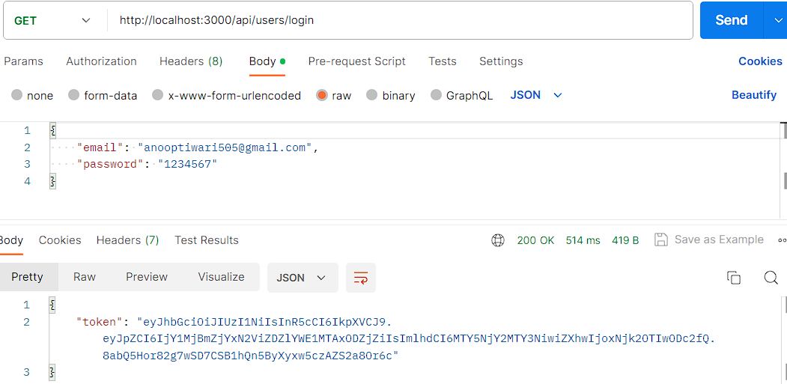
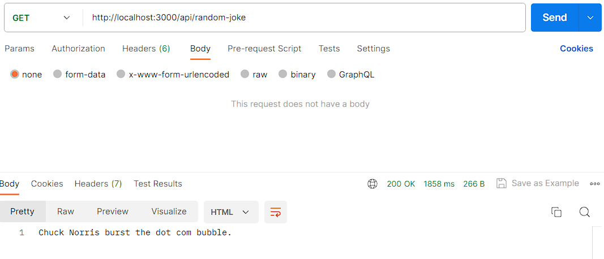

## Description

--> Provided Task is -
-----------------------------------------------------
1. User signup - /api/users/signup
2. User login - /api/users/login
Access by authenticated user only
---------------------------------------
3. View profile - /api/users/me
4. Get a random joke from chuck norris api & return it back - /api/random-joke
GET https://api.chucknorris.io/jokes/random
5. User logout - /api/users/logout
Requirements:
------------------
Use any famous :-
1. NodeJs Framework with TypeScript (Nest js preferred )
2. NodeJs library to validate & sanitize request
3. ORM library to manage data with database
4. Package to handle user authentication
5. Globally handle errors
6. Use middlware to access restricted end points
Notes:
-----------------------------------
1. Commit the code on github & provide the link to review it
2. Add a readme file which has all the steps to run the project
3. Attach a postman collection to test the rest APIs ( You can use any postman alternative as
well but just mention th
e steps)
--------------------------------------------------------

## Installation

```bash
$ npm install
```

## Running the app

```bash
# development
$ npm run start

# watch mode
$ npm run start:dev

# production mode
$ npm run start:prod
```
# -->>

I have used mongodb instead of typeorm for database management.

1. User signup - make post request to http://localhost:3000/api/users/signup and provide name, email and password.



2. User login - make get request to http://localhost:3000/api/users/login and provide registerd email and password



3. Get a random joke from chuck norris api - 
http://localhost:3000/api/random-joke




## License

Nest is [MIT licensed](LICENSE).
